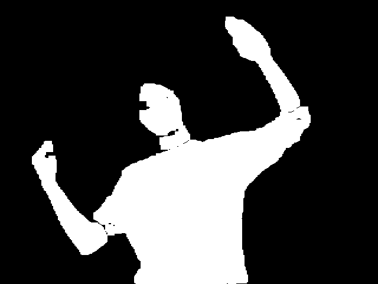

# Hole in the Camera
## Contributors: Ayush Chakraborty, Jiayuan Liu, Anmol Sandhu
### Game Description
Growing up, did you ever watch the game show, Hole In The Wall, and think to yourself, "Wow! I wish that was me!"? Well, if so, you're in luck! Our game, Hole In the Camera, is an at-home friendly version of the popular game show. Each competitor will be presented with 7 holes that they have to fit into. For each trial, they have 10 seconds to fit into the hole and, at the end, will receive a score 0-100 based on how well they fit into the hole. At the end, users will see their final score (the average of the seven rounds) out of 100. Compete against your friends to see who will conquer the holes! The full game repository can be found here: https://github.com/olincollege/hole-in-the-camera.   

### Game Features
Our game leverages three main features in order to ensure a smooth gameflow for users: OpenCV, pygame, and OpenPose. Below is a detailed description of how each features is used within our game:
- OpenCV: OpenCV is one of python's computer vision libraries that allows creators interact with computer cameras and analyze these images. In our game, we use OpenCV to access the user's camera and continuously resize and stream frames into our model to be analyzed. In addition, OpenCV also allows us to create holes for users to fit into. This is done by parsing through the camera output for specific HSV values, and then eroding and dilating them sufficiently until they are rendered to being black and white images representing where a human was in the camera. These become the holes that our game uses for users to fit into.


<br><br>

- Pygame: Pygame allows us to display our game user interface to players. We employ pygame as our view, displaying instructions and results to users as they play the game. Pygame also allows us to constantly display the user's position in the camera frame through the OpenCV output for them to adjust themselves as they try to fit into the displayed hole. In addition, pygame enables us to play music and sound effects during game play to enhance the user experience.


<br><br>

- OpenPose: OpenPose is a public implementation of the Deep Pose algorithm that can be used to determine a human's joint positions in a given image. Our game employs OpenPoses on each hole that will be displayed to users. This determines where each of their joints should line up relative to the camera frame. Then, the user's final position is also analyzed through OpenPose. Once these two sets of joints are calculated, they are compared against each other to determine how well the user fit into the hole they were presented with.  


<br><br>

### Project Goals
Throughout this project, our team was working with three main learning objectives in mind. This goals were:
1. Get comfortable with python's OpenCV library and learn about the nuances of its functions and algorithms.
2. Learn about use-cases for neural networks and effectively employ them in our project.
3. Learn about how to develop software that is considerate of a user's interaction, keeping their experience in mind throughout the development process and allowing their needs to guide our decisions.

### Playing the Game
#### Installing Dependencies
Run the following blocks of code in your terminal to install all the necessary dependencies and python libraries to run the game.

Install Pygame:
```
pip install pygame
```
Install OpenCV:
```
pip install opencv-python
```
Install SciPy:
```
pip install scipy
```
Install PyTorch Packages:
```
pip install torch
pip install torchvision
```
Install Numpy:
```
pip install numpy
```
#### Download Body Pose Model
In order to evaluate how well players fit into the holes, the game employs Deep Pose, which is a deep neural network used to estimate a person's joint positions when given an image. As this deep neural network is rather large, it cannot be pushed to github and must be downloaded from google drive. From this link (https://drive.google.com/drive/folders/1Nb6gQIHucZ3YlzVr5ME3FznmF4IqrJzL?usp=sharing), download the "body_pose_model.pth" file and place it in the deep_pose folder of the hole-in-the-camera directory.

#### Running the Code
Once you have all the dependencies installed and placed "body_pose_model.pth" in its appropriate folder, you're ready to play the game! Navigate to the hole_in_the_camera_runner.py script and run it. Make sure your text editor has access to your camera and can display a pygame pop-up screen and then you're good to go. Have fun!

Note: If you get any errors with camera access or would like to select a different camera for input, go into the hole_in_the_camera_runner.py function and change the CAMERA_INDEX variable (line 10) to be equal to the index of the camera you would like to use.

### Video of Gameplay

### Want to Create Your Own Holes?
While playing the game did you suddenly get inspiration to create your own holes for your friends to try to fit into? Well if so, you're in luck! With our code, you can create your own holes (we recommend having a friend help you with this). Follow the steps below to create your own holes:
1. In the create_mask.py file, change the MASK_NAME variable (line 10) to the name you wish to save the hole as. Note: You can choose to override the game's existing holes by having the same as an existing hole, or pick an entirely new name to add to the potential holes.
2. Run the create_mask.py file with proper lighting conditions. We recommend wearing dark colored clothing and having a white background for the best results.
3. Once you are satisfied with your pose in the camera frame, press the 'd' key on your keyboard, which will save the hole and original image into their respective directories in the hole-in-the-camera folder.
4. Repeat steps 1-3 for as many holes as you want, ensuring that you pick different names for each hole.
5. Next, you need to run the create_csv.py script to analyze each picture you took for joint positions to be used to compare users against in each game round. To do this, change the MASK_NAMES variable (line 10) to be a list of each hole name that you made. Then, run the script.
6. Finally, to make sure your holes are called by the actual game, you need to edit the model of the game. Go into the hole_in_the_camera_model.py file and edit the MASK_NAMES variable (line 49) to be a list of all the holes you want the game to display.
After making these changes, you're all ready to play with your own holes!   

### Game Demo
<iframe width="560" height="315" src="https://www.youtube.com/watch?v=Sm--6dE8Xso" title="YouTube video player" frameborder="0" allow="accelerometer; autoplay; clipboard-write; encrypted-media; gyroscope; picture-in-picture" allowfullscreen></iframe>
<br>

### About the Creators


 
**[Ayush Chakraborty](https://github.com/ayushchakra)** 
Hey, my name is Ayush and I am a Engineering: Computing Major at the Olin College of Engineering. For this game, I took charge on implementing Deep Pose, including learning how it’s structured and how to parse it’s outputs. Some of my interests are embedded systems, machine learning, and back-end software development and I’m always looking for opportunities to learn more in these domains!

<br><br>


**[Jiayuan Liu](https://github.com/Chidunbo)** 
Hi I am Jiayuan. In this project, I am in charge of the game workflow, visualization and sound effect aspect of the game. I am interested in game design and public interest technology.

<br><br><br><br><br>

   

**[Anmol Sandhu](https://github.com/AnmolRattanSingh)**
Hey, I am Anmol. I am a Engineering: Computing major at Olin College. For this game I worked on implementing OpenCV to parse user input and also creating game masks. I am passionate about using platform technologies for solving social and environmental problems.   

<br><br><br>

### Acknowledgements
1. Major inspiration for this game comes from Nickelodeon's game show, Hole in the Wall. Many of the features of our game are based on design features of the real life game and our implementation wouldn't have been possible without it.
2. To analyze our final frames for how well users fit into the displayed holes, we relied on a public github repository called OpenPose (https://github.com/Hzzone/pytorch-openpose). OpenPose is an implementation of Deep Pose, which is a proposed method to finding body joint positions within a given image using a deep neural network. We used this repository for each of our stored holes for where a user's joints should be in the frame, and compared those values to the joint positions found from the user's actual position. All of the code the in deep_pose folder, along with the "body_pose_model.pth" file that users are asked to download are from the OpenPose repository and are not our own code.
3. Backgrounds: 
[istockphoto.com](https://www.istockphoto.com/vector/red-brick-wall-hole-gm587952908-100971081)
[vectorstock.com](https://www.vectorstock.com/royalty-free-vector/human-silhouette-hole-in-brick-wall-pop-art-vector-15729119)
4. Music: [Youtube Audio Library](https://www.youtube.com/c/audiolibrary-channel/videos)